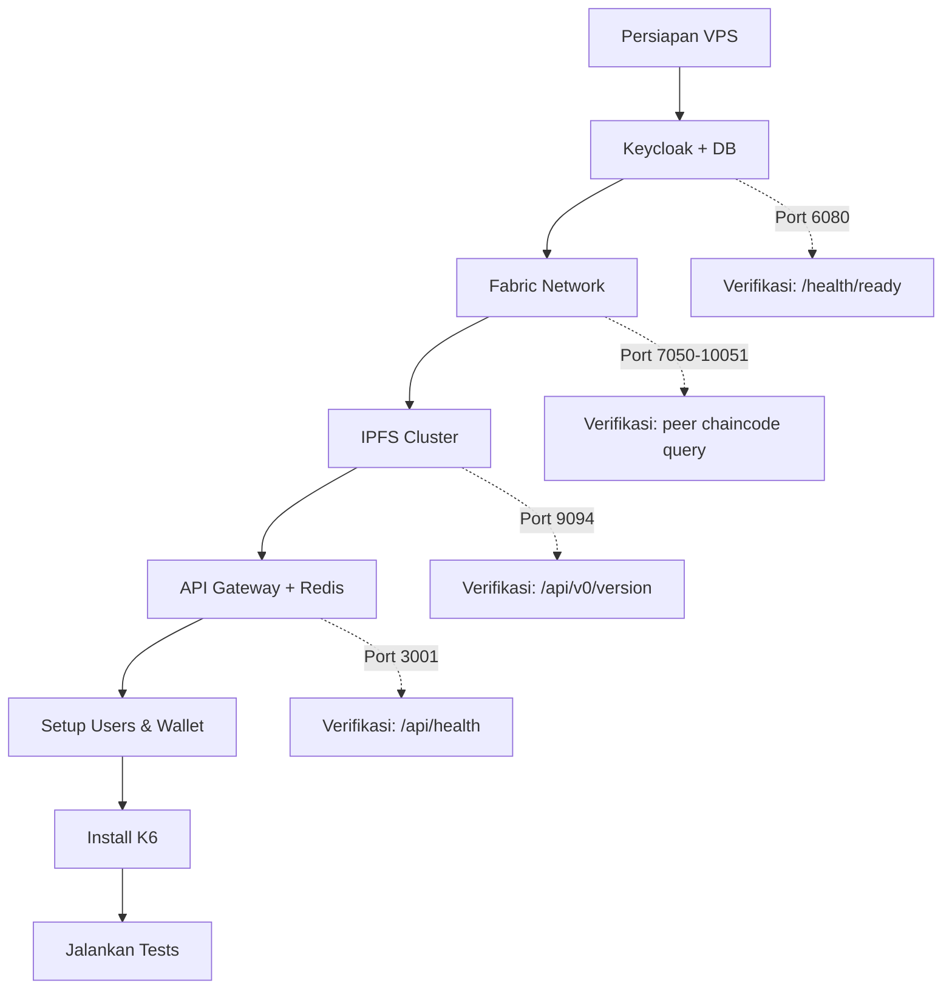

# Panduan Instalasi Single VPS untuk K6 Comparative Testing

> Seed Certification System — 4 Skenario K6 Test
> Target: 1 Server VPS, semua komponen dalam 1 mesin

---

## 📋 Daftar Isi

1. [Spesifikasi VPS](#1-spesifikasi-vps)
2. [Persiapan Awal](#2-persiapan-awal)
3. [Clone Repository](#3-clone-repository)
4. [Step 1: Keycloak + PostgreSQL](#4-step-1-keycloak--postgresql)
5. [Step 2: Hyperledger Fabric Network](#5-step-2-hyperledger-fabric-network)
6. [Step 3: IPFS Cluster](#6-step-3-ipfs-cluster)
7. [Step 4: API Gateway + Redis](#7-step-4-api-gateway--redis)
8. [Step 5: Setup User Testing](#8-step-5-setup-user-testing)
9. [Step 6: Install K6](#9-step-6-install-k6)
10. [Step 7: Jalankan K6 Tests](#10-step-7-jalankan-k6-tests)
11. [Cek Log & Troubleshooting](#11-cek-log--troubleshooting)

---

## 1. Spesifikasi VPS

| Komponen | Minimum | Rekomendasi |
|----------|---------|-------------|
| CPU | 8 vCPU | 12 vCPU |
| RAM | 16 GB | 24 GB |
| Disk | 100 GB SSD | 200 GB SSD |
| OS | Ubuntu 22.04 LTS | Ubuntu 22.04 LTS |
| Docker | 24+ | 24+ |
| Docker Compose | v2+ | v2+ |

### Port yang Digunakan

| Port | Service | Keterangan |
|------|---------|------------|
| 22 | SSH | Akses server |
| 5432 | PostgreSQL (Keycloak) | Database Keycloak |
| 6080 | Keycloak | Identity Provider |
| 3001 | API Gateway | Backend aplikasi |
| 6379 | Redis | Queue & session |
| 7050-10051 | Hyperledger Fabric | Blockchain network |
| 9094-9095 | IPFS Cluster API | Distributed storage |
| 5001-5002 | IPFS Node API | IPFS nodes |

---

## 2. Persiapan Awal

SSH ke VPS, lalu jalankan:

```bash
# Update system
sudo apt update && sudo apt upgrade -y

# Install Docker
curl -fsSL https://get.docker.com -o get-docker.sh
sudo sh get-docker.sh
sudo usermod -aG docker $USER

# Install Docker Compose plugin
sudo apt install docker-compose-plugin -y

# Install dependencies
sudo apt install -y git curl wget jq make gcc

# Install Node.js 18+
curl -fsSL https://deb.nodesource.com/setup_18.x | sudo -E bash -
sudo apt install -y nodejs

# Verifikasi
docker --version
docker compose version
node --version
npm --version
```

> **⚠️ Logout & login ulang** setelah `usermod -aG docker` agar perubahan group生效.

---

## 3. Clone Repository

```bash
sudo mkdir -p /opt/seed-chain
sudo chown $USER:$USER /opt/seed-chain
cd /opt/seed-chain

# Clone dari repo-mu
git clone <repository-url> .
# atau copy dari local
# rsync -avz --exclude 'node_modules' --exclude '.git' ./ rangga@<ip-vps>:/opt/seed-chain/
```

Buat struktur direktori yang diperlukan:

```bash
mkdir -p application/wallet application/logs application/uploads
mkdir -p blockchain/config
mkdir -p monitoring/prometheus monitoring/grafana monitoring/alertmanager
```

---

## 4. Step 1: Keycloak + PostgreSQL

### 4.1 Konfigurasi .env

```bash
cd /opt/seed-chain/idp_keycloak
cp .env.example .env
nano .env
```

Isi file `.env` untuk single-server:

```env
# PostgreSQL
PGDATA=/var/lib/postgresql/data
POSTGRES_DB=keycloak
POSTGRES_USER=keycloak
POSTGRES_PASSWORD=KeycloakDB123!

# Keycloak
KC_DB=postgres
KC_DB_URL_HOST=auth_keycloak_postgres
KC_DB_URL_PORT=5432
KC_DB_DATABASE=keycloak
KC_DB_USERNAME=keycloak
KC_DB_PASSWORD=KeycloakDB123!

KEYCLOAK_ADMIN=admin
KEYCLOAK_ADMIN_PASSWORD=@Keycloak123!

KC_HTTP_ENABLED=true
KC_PROXY=edge
KC_HOSTNAME_STRICT=false
KC_HOSTNAME_STRICT_HTTPS=false
KC_PROXY_HEADERS=xforwarded
KC_SSL_REQUIRED=external
```

> **Catatan**: `KC_PROXY=edge` penting karena Keycloak akan diakses via Nginx reverse proxy.

### 4.2 Jalankan Keycloak

```bash
docker compose up -d
```

### 4.3 Tunggu sampai siap

```bash
# Cek log sampai muncul "Admin console listening"
docker compose logs -f keycloak | grep -m1 "Admin console"

# Test API
curl -s http://localhost:6080/health/ready | jq .
```

### 4.4 Setup Realm dan Users

Buat realm `SeedCertificationRealm`, client `seed-api-gateway` dan `seed-cert-frontend`, serta users testing.

Ada script setup di `idp_keycloak/tests/setup-test-users.sh` — jalankan:

```bash
cd /opt/seed-chain/idp_keycloak
npm install
node tests/setup-test-users.sh  # atau sesuai instruksi di file tsb
```

Atau alternatif: import realm dari file JSON jika tersedia di `volume/import/`:

```bash
docker compose restart keycloak
# Setelah restart, realm akan auto-import
```

> **Verifikasi**: Buka `http://<ip-vps>:6080` → login admin dengan `admin / @Keycloak123!` → cek realm `SeedCertificationRealm` sudah ada dengan client dan users.

---

## 5. Step 2: Hyperledger Fabric Network

Ini adalah bagian paling kompleks. Kita jalankan di Docker Compose.

### 5.1 Setup CA dan Generate Sertifikat

```bash
cd /opt/seed-chain/blockchain

# Pastikan .env sudah sesuai untuk single-server
# Semua IP di set ke localhost karena semua di 1 VPS
nano .env
```

Pastikan `.env` berisi:

```env
IP_ORDERER=localhost
IP_ORDERER2=localhost
IP_ORDERER3=localhost
IP_BPSBP=localhost
IP_DISBUN=localhost
IP_CA=localhost

FABRIC_BIN_PATH=/usr/local/bin
FABRIC_TLS_ENABLED=true
```

### 5.2 Generate Artifacts

```bash
# Setup CA dan generate certificates
./scripts/network.sh setup-ca

# Generate channel artifacts (genesis block, channel tx)
./scripts/network.sh generate-artifacts
```

### 5.3 Start Network

```bash
# Start semua container Fabric
./scripts/network.sh up
```

Tunggu beberapa menit. Cek status:

```bash
./scripts/network.sh status
# atau
docker ps | grep fabric
```

### 5.4 Create Channel dan Deploy Chaincode

```bash
# Buat channel
docker exec cli peer channel create -c benihchannel ...

# atau via script
./scripts/network.sh create-channel

# Deploy chaincode
./scripts/network.sh deploy-chaincode
```

### 5.5 Setup Identitas Wallet untuk API

```bash
# Setup admin identity
./scripts/setup-identities.sh

# Setup TLS certificates untuk koneksi dari application
./scripts/setup-tls-public.sh
```

### 5.6 Verifikasi Fabric

```bash
# Cek peer status
docker exec bpsbp_peer0 peer channel list
docker exec bpsbp_peer0 peer chaincode list --channel benihchannel

# Test chaincode query
docker exec bpsbp_peer0 peer chaincode query \
  -C benihchannel \
  -n benih-certification \
  -c '{"Args":["queryAllSeedBatches"]}'
```

---

## 6. Step 3: IPFS Cluster

### 6.1 Generate Swarm Key (Private Network)

```bash
cd /opt/seed-chain/ipfs_cluster

# Generate swarm key untuk private IPFS network
make init  # atau bash scripts/init-ipfs.sh

# Generate cluster secret
openssl rand -hex 32 > cluster-secret
```

### 6.2 Start IPFS Cluster

```bash
docker compose up -d
```

### 6.3 Tunggu sampai semua node siap

```bash
# Cek log
docker compose logs -f ipfs-node-1 | grep -m1 "Daemon is ready"

# Cek cluster status
curl http://localhost:9094/api/v0/version

# Cek peers
curl http://localhost:9094/api/v0/peers | jq .
```

### 6.4 Verifikasi Upload

```bash
# Test upload file kecil
echo "test" > /tmp/test.txt
curl -X POST -F "file=@/tmp/test.txt" http://localhost:9094/add

# Harus return CID: Qm...
```

---

## 7. Step 4: API Gateway + Redis

### 7.1 Konfigurasi .env

```bash
cd /opt/seed-chain/application
nano .env
```

Sesuaikan untuk single-server:

```env
NODE_ENV=production
PORT=3001

# Keycloak (di VPS sama)
KEYCLOAK_URL=http://localhost:6080
KEYCLOAK_REALM=SeedCertificationRealm
KEYCLOAK_CLIENT_ID=seed-api-gateway
KEYCLOAK_CLIENT_SECRET=<isi dengan secret dari Keycloak>

# IPFS (di VPS sama)
IPFS_API_URL=http://localhost:9094
IPFS_GATEWAY_URL=http://localhost:9090/ipfs
IPFS_HOST=localhost
IPFS_PORT=9094
IPFS_PROTOCOL=http
IPFS_NODE_URL=http://localhost:5001/api/v0

# Hyperledger Fabric (di VPS sama)
FABRIC_NETWORK_PATH=./config/connection-profile.json
FABRIC_CHANNEL=benihchannel
FABRIC_CONTRACT=benih-certification
FABRIC_WALLET_PATH=./wallet
FABRIC_USER_ID=appUser
FABRIC_MSP_ID=BPSBPBenihMSP
FABRIC_CA_URL=http://localhost:7054

# Redis (di VPS sama)
REDIS_HOST=localhost
REDIS_PORT=6379

# ZTA toggle
ZTA_ENABLED=true
IPFS_ENABLED=true

# Rate limiting - longgar untuk load test
RATE_LIMIT_WINDOW_MS=900000
RATE_LIMIT_MAX_REQUESTS=10000
```

### 7.2 Copy Connection Profile

```bash
# Copy connection profile untuk Docker (dengan crypto-config paths)
cp config/connection-profile.json config/connection-profile-docker.json

# Sesuaikan path TLS certs di connection-profile.json
nano config/connection-profile.json
# → Path TLS certs harus absolute di container
# → Semua hostname ganti ke localhost
```

### 7.3 Start dengan Docker Compose

```bash
# Start Redis + API Gateway
docker compose -f docker-compose.yml up -d

# Cek log
docker compose logs -f api-gateway
```

Tunggu sampai muncul:
```
[Server] ✓ Fabric Gateway connected
[Server] ✓ All services initialized successfully
```

### 7.4 Jika ZTA Ingin Dimatikan (untuk baseline)

```bash
# Set ZTA_ENABLED=false di .env, restart
docker compose restart api-gateway
```

---

## 8. Step 5: Setup User Testing

### 8.1 Register Users di Keycloak via API

Ada 2 cara:

**Cara A: Menggunakan script yang sudah ada**

```bash
cd /opt/seed-chain/k6_test
bash setup-test-users.sh
```

**Cara B: Manual via Keycloak Admin Console**

1. Buka `http://<ip-vps>:6080`
2. Login admin: `admin / @Keycloak123!`
3. Masuk realm `SeedCertificationRealm`
4. Buat roles: `role_producer`, `role_pbt_field`, `role_admin`
5. Buat users (username dari file `loadtest.js` — 29 users dengan password `Test123!`)
6. Assign role ke setiap user sesuai mapping di `scenario-3-hl-zta.js`

### 8.2 Enroll Users di Fabric

```bash
cd /opt/seed-chain/k6_test
bash enroll-test-users.sh
```

Proses ini membuat identity wallet untuk setiap user di Fabric CA.

---

## 9. Step 6: Install K6

```bash
# Install K6 di VPS
sudo gpg -k
sudo gpg --no-default-keyring --keyring /usr/share/keyrings/k6-archive-keyring.gpg \
  --keyserver hkp://keyserver.ubuntu.com:80 \
  --recv-keys C5AD17C747E3415A3642D57D77C6C491D6AC1D69
echo "deb [signed-by=/usr/share/keyrings/k6-archive-keyring.gpg] https://dl.k6.io/deb stable main" \
  | sudo tee /etc/apt/sources.list.d/k6.list
sudo apt update && sudo apt install -y k6

# Verifikasi
k6 version  # → v0.52+ (pakai yang terbaru)
```

---

## 10. Step 7: Jalankan K6 Tests

### 10.1 Sesuaikan API_BASE_URL di Script K6

Karena semua di 1 VPS, API Gateway bisa diakses langsung via `localhost:3001` atau via IP publik.

Edit variable `API_BASE_URL` di setiap file scenario:

```bash
cd /opt/seed-chain/k6_test

# Untuk akses via localhost (tanpa SSL):
sed -i 's|https://gateway.jabarchain.me|http://localhost:3001|g' scenario-*.js

# Untuk akses via IP publik (tanpa SSL):
# sed -i 's|https://gateway.jabarchain.me|http://<ip-vps>:3001|g' scenario-*.js
```

> **Catatan**: Jika pakai localhost, pastikan API Gateway expose port 3001 ke `0.0.0.0` (default sudah).

### 10.2 Update Endpoint Login di Script K6

Endpoint login perlu disesuaikan. Di `.env` application, login endpoint-nya:

```bash
# Cek route identity di application
# POST /api/v1/identity/login → gateway login
```

Script k6 menggunakan `API_BASE_URL/api/v1/identity/login` — pastikan ini sesuai.

### 10.3 Test: Pastikan Service Beres

```bash
# Cek semua container berjalan
docker ps | grep -E "seed|fabric|ipfs|keycloak"

# Test API Gateway
curl -s http://localhost:3001/api/health | jq .
# → {"status":"ok","services":{"fabric":true,"keycloak":true,"ipfs":true}}

# Test login
curl -s -X POST http://localhost:3001/api/v1/identity/login \
  -H "Content-Type: application/json" \
  -d '{"username":"1E1DFC06","password":"Test123!"}' | jq .
# → {"success":true,"data":{"accessToken":"eyJ..."}}
```

### 10.4 Jalankan Skenario

```bash
cd /opt/seed-chain/k6_test

# Pastikan direktori reports ada
mkdir -p reports

# =========================================
# JALANKAN MANUAL SATU PER SATU
# =========================================

# Scenario 1: Hyperledger Only (Baseline)
k6 run scenario-1-hl-baseline.js \
  --out csv=reports/result-scenario-1.csv

# Scenario 2: Hyperledger + IPFS
k6 run scenario-2-hl-ipfs.js \
  --out csv=reports/result-scenario-2.csv

# Scenario 3: Hyperledger + ZTA
k6 run scenario-3-hl-zta.js \
  --out csv=reports/result-scenario-3.csv

# Scenario 4: Hyperledger + ZTA + IPFS (Full)
k6 run scenario-4-hl-zta-ipfs.js \
  --out csv=reports/result-scenario-4.csv

# =========================================
# ATAU PAKAI RUNNER (yang sudah dibuat)
# =========================================

# Mode quick test (~8 menit)
./run-comparative.sh --quick

# Mode full test (~35 menit)
./run-comparative.sh
```

---

## 11. Cek Log & Troubleshooting

### 11.1 Log Masing-masing Service

```bash
# Keycloak
docker logs -f auth_keycloak --tail 50

# Fabric — peer
docker logs -f bpsbp_peer0 --tail 50

# IPFS
docker logs -f ipfs-node-1 --tail 20
docker logs -f ipfs-cluster-1 --tail 20

# API Gateway
docker logs -f seed-api-gateway --tail 50

# Redis
docker logs -f seed-redis --tail 20
```

### 11.2 Masalah Umum

| Masalah | Penyebab | Solusi |
|---------|----------|--------|
| API Gateway error `Fabric Gateway not connected` | Fabric belum siap | Tunggu Fabric siap, restart `docker compose restart api-gateway` |
| Login gagal 401 | Keycloak realm/users belum di-setup | Cek Keycloak admin console |
| IPFS upload gagal | Cluster belum sinkron | `curl http://localhost:9094/api/v0/peers` — pastikan ada 2 peers |
| Rate limit 429 | Terlalu banyak request | Set `RATE_LIMIT_MAX_REQUESTS=10000` di `.env` |
| ZTA deny semua (403) | Role user salah | Cek user di Keycloak punya `role_producer` |
| Connection refused :3001 | API Gateway crash | `docker logs seed-api-gateway --tail 30` |
| Fabric timeout | Resource overload di single VPS | Kurangi VU di skenario (edit stage di options) |

### 11.3 Resource Monitor

Jalankan di terminal kedua saat k6 berjalan:

```bash
# CPU dan RAM realtime
htop

# Docker resource usage
docker stats

# Disk
df -h

# Specific: Fabric peer CPU
docker stats bpsbp_peer0 --no-stream
```

---

## Ringkasan Urutan Deploy



### Estimasi Waktu

| Step | Aktivitas | Durasi |
|------|-----------|--------|
| 1 | Persiapan VPS | 15 menit |
| 2 | Clone repo + setup | 5 menit |
| 3 | Keycloak + PostgreSQL | 10 menit |
| 4 | Realm + Users setup | 15 menit |
| 5 | Fabric Network (CA → up → channel → chaincode) | 30-45 menit |
| 6 | Setup wallet & identitas | 10 menit |
| 7 | IPFS Cluster | 10 menit |
| 8 | API Gateway + Redis | 10 menit |
| 9 | Verifikasi akhir | 10 menit |
| 10 | Install K6 | 5 menit |
| **Total** | | **~2 jam** |

Setelah semua selesai, tinggal jalanin test k6-nya 🚀
